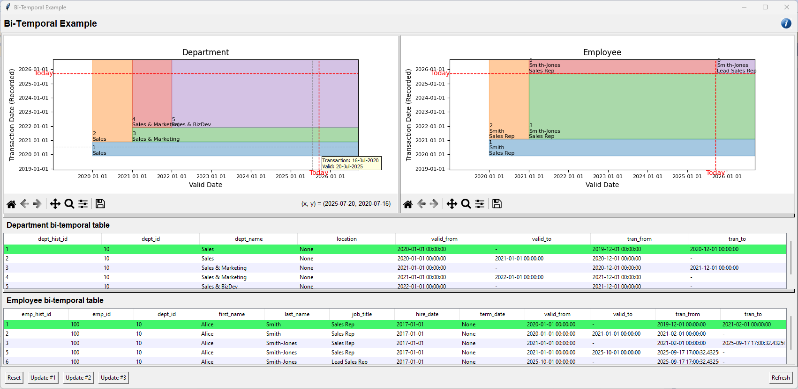

# Project Title: BiTemporal

A Python app to represent an example bi-temporal data set in a chart.

## Motivation

The concept of bi-temporal data—managing and interpreting both the transaction date (when data was recorded in the system) and the valid date (when the data is considered accurate in the real world)—can often be abstract and difficult to explain in theory alone. To make this easier to understand, I created a simple Python application that sources an example set of Department data from a SQL Server table and represents it visually.

By plotting the data with the transaction date on the y-axis and the valid date on the x-axis, the chart provides a clear way to see how these two dimensions interact over time. The goal is not to build a production-ready tool, but rather to offer an approachable, visual illustration of bi-temporal concepts for learning, teaching, or discussion.

 

## Setup

### Database

The example supports both SqlServer and PostgreSql. 

#### SqlServer

The [Create.sql](./SqlServer/Create.sql) creates:

* A function __fn_infinity__, to return a DATETIME2 value of *'9999-12-31 23:59:59.9999999'*
* Tables __department_master__, __department__ & __employee__ to store the bi-temporal data
* A view __vw_department_current__ to return valid Departments effective of the current system date
* A trigger __tr_department_instead_of_update__ which manages the transaction process when an attribute of the Department is updated
* A procedure to __get_department__ which return Departments for a specific transaction and valid date
* A procedure __reset_data__ which is then executed to initialises the example's seed 
* Functions __fn_as_of_department__ and __fn_as_of_employee__ to return data as of specified *tran_date* and *valid_date*, used in queries contained in [Queries_Multiple.sql](./SqlServer/Queries_Multiple.sql)

The file can be re-executed to re-create the database objects.

Further files: 

* [Queries.sql](./SqlServer/Queries.sql) contains some example update statements, queries and example procedure calls, although the app itself provides all the necessary database interaction for this example.
* [Queries_Multiple.sql](./SqlServer/Queries_Multiple.sql) contains examples of querying of linked bi-temporal tables given a *tran_date* and *valid_date*.

#### PostgreSql

The [Create.sql](./PostgreSql/Create.sql) creates:

* A Schema __dbo__ (to avoid changing Sql with Python code)
* A function __fn_infinity__, to return a TIMESTAMP WITH TIME ZONE value of *'9999-12-31 23:59:59.999999'*
* Tables __department_master__, __department__ & __employee__ to store the bi-temporal data* Creates a view __vw_department_current__ to return valid Departments effective of the current system date
* A trigger __tr_department_update__ (and corresponding function) which manages the transaction process when an attribute of the Department is updated
* A procedure __reset_data__ which is then executed to initialises the example's seed 

The file can be re-executed to re-create the database objects.

* [Queries.sql](./PostgreSql/Queries.sql) contains some example update statements, queries and example procedure calls, although the app itself provides all the necessary database interaction for this example.

### Python App

The python code expects *.env* file to be located in the same folder as the *BiTemporal.py* file and contain the necessary connection values: 

```Text
# Database - select one
DB_PRODUCT=SqlServer  # Default
#DB_PRODUCT=PostgreSql

# SqlServer connection values
DB_DRIVER=ODBC+Driver+17+for+SQL+Server

# PostgreSql connection values
DB_USER=your_user
DB_PASSWORD=your_password
DB_PORT=your_port

# common connection values
DB_NAME=dept_emp_bitemporal
DB_HOST=localhost
```

## How to use the app

On first running the app you will see the charts and tables reflecting the initial seed Department and Employee data for Department 10.

There are two buttons with predefined __UPDATE__ statements to modify Department 10's title from a specific effective date. On performing the updates the affect will be shown in the chart and the table (which is the contents of the __department__ database table for Department 10).

To re-initialise the data click __Reset__.

## License

This project is licensed under the MIT License – see the [LICENCE](./LICENCE) file for details.